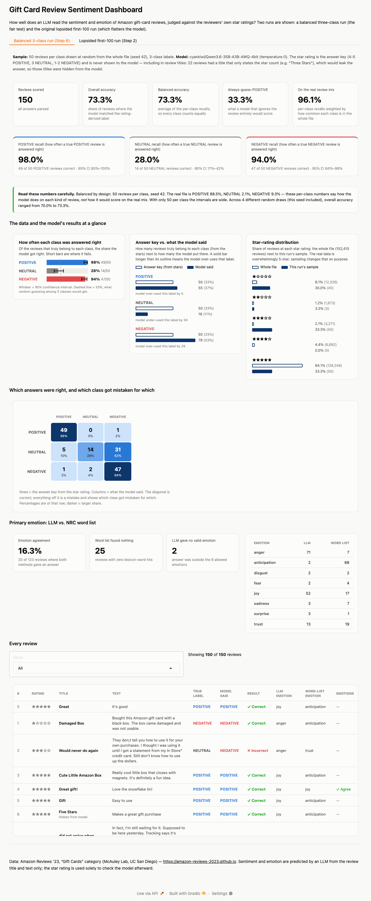

# Sentiment & Emotion Classification of Amazon Gift-Card Reviews

MBAX 6418 — Assignment 1. An LLM classifies each Amazon gift-card review as POSITIVE / NEUTRAL / NEGATIVE and names its primary emotion; the answers are checked against the reviewers' own star ratings and shown in an interactive dashboard.

**Headline.** On the original lopsided first-100 sample the model scores **97.0%**, which looks excellent. On a balanced three-class sample it scores **73.3%**, and it recognises only **28%** of the three-star (NEUTRAL) reviews — 62% of them are called NEGATIVE. Weighted to the real class mix of the data, the balanced results imply **96.1%**, i.e. the lopsided run's high score reflects how skewed the data is, not skill on the hard class.



*The dashboard's balanced-run tab (the first-100 run is a second tab: [screenshot](docs/screenshots/dashboard-lopsided-first100.png)).*

## Data

[Amazon Reviews '23](https://amazon-reviews-2023.github.io) (McAuley Lab, UC San Diego), **Gift Cards** category: 152,410 reviews. Direct file: `https://mcauleylab.ucsd.edu/public_datasets/data/amazon_2023/raw/review_categories/Gift_Cards.jsonl.gz`. Citation:

> Hou, Y., Li, J., He, Z., Yan, A., Chen, X., McAuley, J. (2024). *Bridging Language and Items for Retrieval and Recommendation.* arXiv:2403.03952.

Emotion word list: the NRC Word-Emotion Association Lexicon (Mohammad & Turney), obtained through the [`nrclex`](https://pypi.org/project/NRCLex/) package's bundled data file; only the raw word→emotion table is used, the scoring is our own.

**How lopsided the data is.** Star ratings in the whole file: 1★ 12,326 · 2★ 1,873 · 3★ 3,271 · 4★ 6,692 · **5★ 128,248 (84.1%)**. Under the assignment's classes that is **POSITIVE 134,940 (88.5%) · NEUTRAL 3,271 (2.1%) · NEGATIVE 14,199 (9.3%)**. NEUTRAL is very rare, so reading rows in order almost never exercises it.

## What is in this repo

| Deliverable | File |
|---|---|
| The prompts | [`prompts/sentiment_emotion_three_class.txt`](prompts/sentiment_emotion_three_class.txt) (Step 6), [`prompts/sentiment_emotion_binary.txt`](prompts/sentiment_emotion_binary.txt) (Steps 1–5, kept so the first-100 run stays reproducible) |
| Scoring script (runs the reviews) | [`src/score_batch.py`](src/score_batch.py), using [`src/classify.py`](src/classify.py) |
| Word-list emotion script | [`src/emotion_wordlist.py`](src/emotion_wordlist.py) |
| Dashboard (generator + app) | [`src/dashboard.py`](src/dashboard.py) — Gradio; reads only the saved output |
| One balanced run's raw output | [`output/step6/records.json`](output/step6/records.json) (per-review, incl. the model's raw reply) and [`summary.json`](output/step6/summary.json) |
| Lopsided run's raw output | [`output/step2/`](output/step2/) |
| Checks | [`src/verify_numbers.py`](src/verify_numbers.py), [`src/check_repeatability.py`](src/check_repeatability.py), [`src/check_leakage.py`](src/check_leakage.py) → `output/step6/{repeatability,leakage_check,seed_sensitivity}.json` |

## Reproduce

```bash
python -m venv venv && ./venv/bin/pip install -r requirements.txt
cp .env.example .env          # add an OpenAI-compatible endpoint + key (not needed just to view results)
mkdir -p data && curl -L -o data/Gift_Cards.jsonl.gz https://mcauleylab.ucsd.edu/public_datasets/data/amazon_2023/raw/review_categories/Gift_Cards.jsonl.gz && gunzip -k data/Gift_Cards.jsonl.gz

# the two runs reported below (each ~10 s)
./venv/bin/python src/score_batch.py --mode binary --sample first --n 100 --out output/step2
./venv/bin/python src/score_batch.py --mode three --sample balanced --per-class 50 --seed 42 --out output/step6

./venv/bin/python src/verify_numbers.py   # recompute every number from records.json + the raw file
./venv/bin/python src/dashboard.py        # http://localhost:7860
```

**Repeatability, honestly.** The *sample* is fixed (seed 42) and every reported number is computed deterministically from the saved `records.json`. The *model* is not: the shared endpoint is not bit-deterministic even at temperature 0 with a pinned seed and one request at a time (see Q4). Re-scoring the same 150 reviews five more times gave **72.0%, 72.0%, 73.3%, 74.0%, 72.0%** (saved run: 73.3%), so re-running yields numbers within roughly ±1 point, not identical ones. The saved run is the source of record. To view or re-verify the results no endpoint access is needed.

## Method

- **Answer key.** Rating 4–5 → POSITIVE, 3 → NEUTRAL, 1–2 → NEGATIVE. (The first-100 run used the assignment's earlier binary rule: ≥4 POSITIVE, else NEGATIVE.) The model is only given the review's title and text — never the rating.
- **Prompt.** One call returns strict JSON `{"sentiment": …, "emotion": …}`. Edge cases decided in the prompt: body text outweighs a conflicting title; sarcasm counts as NEGATIVE; short reviews still get a committed answer; NEUTRAL means genuinely mixed, lukewarm, or purely factual — and a brief plainly favourable review is POSITIVE, not NEUTRAL. Emotion is one of the 8 NRC categories so it is directly comparable to the word list.
- **Balanced sample.** 50 reviews from each class drawn from the whole file with `random.Random(42)`, without replacement (150 total).
- **Word-list emotion.** Count each review's words against the NRC lexicon per emotion; the highest count wins (ties resolve by a fixed emotion order); none if no word matches.
- **Reporting.** Alongside accuracy: per-class recall with 95% Wilson intervals, precision, *balanced accuracy* (mean of recalls), the always-guess-the-majority baseline, and accuracy re-weighted to the whole file's class mix.

## Results

| | Lopsided (Step 2) | Balanced (Step 6) |
|---|---|---|
| Sample | first 100 rows, 2 classes | 50 per class, seed 42, 3 classes |
| Class counts in sample | POSITIVE 93 · NEGATIVE 7 | POSITIVE 50 · NEUTRAL 50 · NEGATIVE 50 |
| Overall accuracy | **97.0%** | **73.3%** |
| Balanced accuracy (mean recall) | 91.8% | 73.3% |
| Always-guess-POSITIVE baseline | 93.0% | 33.3% |
| Recall POSITIVE | 97.8% (91/93) | 98.0% (49/50), 95% CI 90–100% |
| Recall NEUTRAL | — | **28.0% (14/50), 95% CI 17–42%** |
| Recall NEGATIVE | 85.7% (6/7), 95% CI 49–97% | 94.0% (47/50), 95% CI 84–98% |
| Accuracy weighted to the real class mix | 96.5% | 96.1% |

Across four different random balanced draws (seeds 42, 7, 123, 2024) overall accuracy was 73.3%, 70.0%, 70.7%, 72.0%; NEUTRAL recall 28%, 28%, 22%, 32%. Seed 42 happens to be the most flattering draw and was fixed before scoring, not chosen after; its POSITIVE class contains no 4★ reviews (other seeds: 2, 0, 1).

## The four questions

### 1. Why did the lopsided run look so accurate, and what did equal sampling change?

The first 100 rows are 93% POSITIVE, and the model is very good at POSITIVE (97.8% recall). A model that answered POSITIVE every time would already score **93.0%**, so the model's 97.0% is only 4 points above doing nothing. Its NEGATIVE score (85.7%) rests on **7 reviews** (95% CI 49–97%), and NEUTRAL was not a class at all — the two 3★ reviews in that sample were folded into NEGATIVE. Balanced accuracy was already lower (91.8%).

Equal sampling changed what the score means: each class now carries a third of the weight, the do-nothing baseline drops to 33.3%, and the rare class the lopsided run could not see is exposed — NEUTRAL recall of 28%. Overall accuracy fell to **73.3%**. That drop combines two changes (adding NEUTRAL *and* rebalancing), so it is not a like-for-like comparison; the cleaner statement is the last table row: weighting the balanced recalls by the file's real mix gives **96.1%**, almost exactly the lopsided run's number. The 97% was not wrong — it just answers "how often is the model right on the reviews that actually exist", which is dominated by the easy class, not "how good is it at each kind of review".

### 2. Where do the mistakes go?

Balanced run (rows = answer key from stars, columns = model's answer; 50 reviews per row):

| true \ answered | POSITIVE | NEUTRAL | NEGATIVE |
|---|---|---|---|
| POSITIVE | **49** | 0 | 1 |
| NEUTRAL | 5 | **14** | **31** |
| NEGATIVE | 1 | 2 | **47** |

3★ reviews do **not** get their own class: 31 of 50 (62%) were answered NEGATIVE, 5 (10%) POSITIVE, and only 14 (28%) NEUTRAL. The direction is one-sided: NEUTRAL reviews are absorbed into NEGATIVE, while only 2 of 50 NEGATIVE reviews were called NEUTRAL. The model answered NEUTRAL just 16 times out of 150 (the key has 50); when it does say NEUTRAL it is usually right (precision 14/16 = 87.5%), it just says it too rarely. Because so many NEUTRAL reviews land in NEGATIVE, NEGATIVE's precision is only 47/79 = 59.5% even though its recall is 94%. Across the four seeds, 3★→NEGATIVE was 31, 35, 36 and 28 out of 50 — the pattern is not a quirk of one draw.

Reading the mistakes suggests this is partly the *answer key* and not only the model: many 3★→NEGATIVE reviews are genuine complaints (a card that had not arrived on schedule, a price field that kept changing the amount, unclear instructions that ended in an unexpected charge), so a text-only reader calling them NEGATIVE is defensible. The 3★→POSITIVE cases are mostly very short favourable reviews ("Nice", "Work"). The prompt's NEUTRAL definition also matters; alternative prompts were not tested, so the 28% is specific to this one.

### 3. How do the LLM's emotions and the word list's differ, and why?

They agree on only **20 of 123** balanced-run reviews where both gave an answer (**16.3%**; first-100 run: 21/84, 25.0%).

| | anger | anticipation | joy | trust | other |
|---|---|---|---|---|---|
| LLM | 71 | 2 | 52 | 13 | 10 (+2 invalid) |
| Word list | 7 | **68** | 17 | 19 | 14 (no answer for 25) |

- The **LLM reads meaning**: it says *anger* for negative and neutral complaints (71) and *joy* for praise (52), following the sentiment.
- The **word list counts words**, and the NRC lexicon tags many everyday words with several emotions at once ("good", "perfect", "money" all carry *anticipation*). Anticipation is the top score in 68 of the 125 reviews it could answer — and 51 of those 68 were **ties** that the fixed tie-break order resolves toward *anticipation*, so part of that dominance is an artefact of the method. On NEGATIVE reviews the word list's most common answer is *anticipation* (22 of 50), and for the 71 reviews the LLM called *anger* it said *anticipation* 33 times.
- The word list also cannot see negation or context, and **finds nothing at all in 25 of 150 reviews** (median 4 words — "Nice", "Work"), where the LLM always answers. The LLM occasionally leaves its allowed vocabulary (2 answers, e.g. "disappointment"); those are counted as "no valid emotion", not repaired.

### 4. Bugs and issues along the way, and workarounds

*Data / evaluation*
- **The rating leaked through review titles.** Amazon fills a skipped title with the star count ("Three Stars"): 31,967 reviews (21.0% of the file) have such a title, and it states the true rating in 31,935 of them. 22 of the 150 balanced-sample reviews had one. Such titles are now hidden from both the model and the word list (marked "hidden from model" in the dashboard). An ablation on the same sample (3 runs each way) shows the leak mattered: accuracy on those 22 reviews **87.9% with the title visible vs 77.3% hidden**; overall 74.4% vs 72.9%.
- **The model endpoint is not deterministic**, even at temperature 0 with a pinned seed. I first suspected my 8 parallel workers changing the server's batching; sending one request at a time did **not** help (two sequential runs still differed), so the cause is on the server. Workaround: measure and report the spread (Repeatability section) and treat saved output as the source of record.
- **Combining tasks in one prompt is not neutral.** In an early run, adding the emotion request to the sentiment prompt moved first-100 accuracy from 96% to 97% (one sarcastic-sounding review flipped; see the Step 5 commit message).
- **Reasoning model returned empty answers.** The endpoint's Qwen3 model spent the whole token budget "thinking" and returned `content=None`; fixed by disabling thinking through `chat_template_kwargs`.
- **Thin token margin.** Replies use ~22 tokens against an initial limit of 30, with no check for truncation; raised to 60 and `finish_reason` is now recorded (0 truncated in the saved runs).
- **Out-of-vocabulary emotion** ("disappointment") is counted explicitly rather than silently dropped.

*Dashboard / UI*
- **Review text rendered as HTML.** Many reviews contain the original listing's literal `<br />` (row 4 of the first-100 sample is one); the browser was interpreting it as markup, and reviews could contain worse. Fixed with `html.escape` on all review text.
- **Gradio's default theme is dark**, which made all text near-white on the light page. Overriding its theme variables fixed that — but my first broad CSS override then *flattened every inline colour* (status colours turned black, and the dark confusion-matrix cells became black-on-navy and unreadable). Found only by zooming into a screenshot; fixed by scoping the override to Markdown blocks and setting colour on the cells' inner elements. Also fixed: black row borders and a near-black dropdown focus state from Gradio's styles.
- **A table column was clipped off-screen** in the first (static HTML) version because the table was wider than its card; the dashboard now scrolls the table inside its own container.
- **Tiny chart bars:** value labels sit beside bars (never on them), non-zero bars have a 6px minimum, and zero-value bars draw nothing; verified in the browser (smallest non-zero bar renders 6px wide).

*Process with the agent*
- The system had two root-owned dotfiles (`~/.config`, `~/.zshrc`), which broke GitHub CLI login until ownership/config location was fixed.
- I first missed the black-on-navy bug because I checked values, not contrast; the final browser check therefore also tests text/background contrast.
- The preview browser's Gradio dropdown ignored simulated typing, so filters were tested by driving real click events and, separately, by checking every filter's row count against the confusion matrix in Python.

## How the numbers were checked

- `src/verify_numbers.py` recomputes every headline number from `records.json` **without** calling the scorer's code (answer key derived from the star ratings; confusion matrix, recalls, balanced and re-weighted accuracy, emotion agreement) and recounts the whole-file rating and star-title counts from the raw data: all checks pass.
- An in-browser pass on the running dashboard compared 111 values against numbers computed independently from the raw records — displayed percentages, confusion-matrix cells, chart bar values and pixel geometry, and table row counts — with zero mismatches. Every dashboard filter's row count also equals the corresponding confusion-matrix cell.
- Screenshots were produced by running `python src/dashboard.py --start-tab balanced|lopsided` and capturing it with headless Chrome.

## Limitations

- 50 reviews per class is small: the intervals above are wide (NEUTRAL recall could plausibly be 17–42%), and the four draws differ by up to ~3 points.
- The star rating is a noisy answer key, particularly for 3★; "wrong" does not always mean the model misread the text.
- One model, one prompt, and no NEUTRAL prompt variants were compared.
- Word-list emotion is a deliberately simple baseline (no negation, no context).
- The dashboard is forced to a light theme regardless of the viewer's OS setting.

---
*Built with an AI coding agent (Claude Code) directing the work; the draft of this report was generated with the agent from the saved output and then reviewed by the author.*
